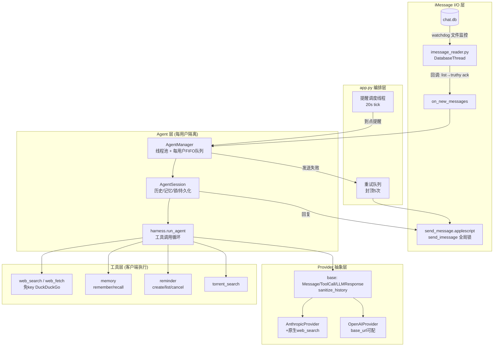

# iMessage Agent

把你的 Mac 上的 **iMessage 变成一个 AI 助理**：别人给你发 iMessage，AI 自动读取、思考、（必要时）联网查资料 / 记事 / 定提醒 / 找资源，再用 iMessage 回过去。

和"套壳聊天机器人"最大的不同：**每个联系人是一个逻辑隔离的独立 Agent** —— 各自独立的对话历史、独立的长期记忆、独立的工具状态，多个用户并发处理、互不阻塞。AI 由一套**自研的轻量 harness**（工具调用循环）驱动，可以自主决定调用哪些工具、调用几次。

LLM 后端做了**双后端抽象**，可在后台一键切换：

- **Anthropic Claude**（`claude-opus-5` 等）
- **任意 OpenAI 兼容接口**（DeepSeek / Qwen / GLM / 本地 vLLM 等，填 `base_url` 即可）

---

## 目录

- [能干什么](#能干什么)
- [快速开始](#快速开始)
- [配置项说明](#配置项说明)
- [技术架构](#技术架构)
- [Harness 是怎么设计的](#harness-是怎么设计的)
- [每用户隔离与并发模型](#每用户隔离与并发模型)
- [工具](#工具)
- [联网搜索怎么工作](#联网搜索怎么工作)
- [安全设计（防乱发 / 防泄漏）](#安全设计防乱发--防泄漏)
- [数据与持久化](#数据与持久化)
- [目录结构](#目录结构)
- [排查](#排查)

---

## 能干什么

- **一对一 AI 对话**：联系人发消息 → AI 回复，保持多轮上下文。
- **联网搜索**：查最新信息后回答，并给出来源网址。**免 key 开箱即用**（内置客户端搜索工具，默认走 DuckDuckGo），换任何后端都不会失效；端点本身支持联网时也可改用其原生能力。详见[联网搜索怎么工作](#联网搜索怎么工作)。
- **长期记忆**：跨会话记住用户的偏好和事实（"我是程序员""叫我老王"），下次对话自动带上。
- **定时提醒 / 任务**："十分钟后提醒我喝水""明早八点叫我" → 到点主动给用户发 iMessage。
- **BT 资源搜索**：找影视 / 软件的磁力链接，返回标题、大小、做种数。
- **图片理解**：直接发图片（含 iPhone 的 HEIC），自动转码后交给多模态模型识别。
- **Web 管理后台**：配置后端与工具、查看每个用户的 Agent 状态、看运行日志。

> 工具是**可插拔**的，`tools/` 下按同一套接口加一个类即可扩展。

---

## 快速开始

### 环境要求

- **macOS**（需要 iMessage 和 `chat.db`）
- **Python 3.9+**
- 终端需要「**完全磁盘访问权限**」才能读 iMessage 数据库

### 安装 & 运行

```bash
chmod +x run.sh
source run.sh          # 首次会自动建 venv、装依赖、启动
```

然后浏览器打开 **http://localhost:8877**：

1. 选 Provider（Anthropic 或 OpenAI 兼容），填 API Key / Base URL / 模型
2. 勾选需要的工具，保存配置
3. 点「测试连接」确认后端可用
4. 点「启动服务」开始监听 iMessage

### 授予磁盘访问权限

系统设置 → 隐私与安全性 → 完全磁盘访问权限 → 添加你的终端（Terminal / iTerm）→ **重启终端**。

> 没有这个权限读不到 `~/Library/Messages/chat.db`，服务会提示无法访问数据库。

---

## 配置项说明

配置存在 `config.json`（**已 gitignore，含 API key，不会入库**）。后台可改的主要项：

| 分类 | 键 | 说明 |
|---|---|---|
| 后端 | `provider` | `anthropic` 或 `openai`，决定当前生效的后端（两套配置都保存，随时切） |
| Anthropic | `anthropic_api_key` / `anthropic_model` / `anthropic_base_url` | 默认模型 `claude-opus-5` |
| OpenAI 兼容 | `openai_api_key` / `openai_base_url` / `openai_model` | 如 `https://api.deepseek.com/v1` + `deepseek-chat` |
| 搜索 | `openai_search_param` | 端点**自带**联网搜索的参数名，**默认空 = 用内置搜索工具**。MiniMax M3 可试 `web_search_linkup`，Qwen/DashScope 填 `enable_search`；填错会 400 |
| 搜索 | `search_backend` / `search_api_key` | 内置搜索工具用哪家：留空 = 免 key 的 DuckDuckGo；也可选 `serper` / `tavily` / `brave` 并配 key 提升质量 |
| Agent | `system_prompt` | 自定义系统提示词，留空用内置人设 |
| Agent | `max_tokens` / `max_iters` / `history_limit` | 单次输出上限 / 工具循环上限 / 每用户保留的历史条数 |
| 工具 | `enable_web_search` / `enable_memory` / `enable_reminder` / `enable_torrent` | 各工具开关 |
| 安全 | `reply_in_groups` | 是否在群聊里回复，**默认关**（见[安全设计](#安全设计防乱发--防泄漏)） |
| 服务 | `use_file_watcher` / `check_interval` | 文件监控（实时，推荐）或定时轮询 |

---

## 技术架构

整体是「**iMessage I/O 层 + Agent 编排层 + Provider 抽象层 + 工具层**」四段，`app.py` 只做 Flask 路由和线程编排，不含任何 AI 逻辑。



### 各层职责

| 层 | 文件 | 职责 |
|---|---|---|
| **I/O** | `imessage_reader.py` | 用 watchdog 监控 `chat.db`，检测新消息，通过**回调契约**（收到 `list`、返回 truthy 表示接住）交给上层；`send_message.applescript` + `send_imessage` 负责发送 |
| **编排** | `app.py` | Flask 路由、线程编排、回调分发、发送重试队列、提醒调度线程 |
| **Agent** | `agent/` | `manager`（每用户调度）+ `session`（单用户状态）+ `harness`（工具循环） |
| **Provider** | `providers/` | 把不同 LLM 后端归一化成同一套 `Message/ToolCall/LLMResponse` 接口 |
| **工具** | `tools/` | 客户端执行的自研工具（联网搜索 / 记忆 / 提醒 / BT），provider 无关 |
| **辅助** | `text_format.py` / `image_prep.py` / `config.py` | 出站 Markdown 清洗 / 图片预处理 / 配置 |

---

## Harness 是怎么设计的

Harness 是这个项目的核心——一套**provider 无关的工具调用循环**。目标是：让 AI 能自主决定调用哪些工具、把结果读回来继续想，直到产出最终回复，而这套逻辑**不绑定任何一家 LLM**。

### 三个约定的数据结构（`providers/base.py`）

Harness 全程只跟这三个归一化结构打交道，具体后端负责翻译进/出：

```python
Message      # role: system/user/assistant/tool；可带 tool_calls / images / raw
ToolCall     # id, name, arguments  —— 模型发起的一次客户端工具调用
LLMResponse  # assistant_message（成型的一轮，可直接入历史）+ tool_calls + text
```

`LLMProvider.chat(messages, tools) -> LLMResponse` 是唯一接口。加一个新后端 = 实现这一个方法。

### 循环本体（`agent/harness.py`）

```
组装 base_messages = [system + 记忆摘要 + 历史 + 本轮用户消息(含图片)]
loop（上限 max_iters，默认 8）：
    resp = provider.chat(base_messages + 已追加, tools=注册表.schemas())
    追加 resp.assistant_message 到历史
    若 resp 没有 tool_calls：
        return  resp.text（空则兜底一句，绝不让用户收到沉默）
    否则对每个 tool_call：
        result = 注册表.dispatch(ctx, name, args)   # 异常一律转错误字符串，绝不炸整轮
        追加 tool 结果消息
    继续下一轮
到达上限仍在要工具 → 补一句干净的收尾，保证历史结构完整
```

几个刻意的设计点：

- **工具异常隔离**：`ToolRegistry.dispatch` 把任何工具异常（含参数不对）转成一句错误字符串回填给模型，单个工具坏掉不会让整轮对话崩掉。
- **迭代上限兜底**：到 `max_iters` 还在要工具，补一个纯文本 assistant 收尾，历史不会以悬空的 tool 结果结尾。
- **空回复兜底**：模型把预算全花在思考上、返回空文本时，回一句友好提示而不是沉默。

### 双后端翻译与"忠实回放"

Harness 存的是归一化 `Message`；每个 provider 在 `chat()` 里翻译成自家格式：

- **Anthropic**：`system` 单独提取；assistant 轮翻成 content-block（`text` + `tool_use`）；连续的 `tool` 结果合并成一个 `user` 轮的 `tool_result` 块。可挂**原生 server tool** 做联网（`web_search_20260209` / `web_fetch_20260209`），并处理 `pause_turn` 续跑。
- **OpenAI**：直接映射成 `messages` + `tools=[{type:function}]` + `tool_calls`；剥离推理模型的 `<think>` 块。

为了在同一轮的多次工具往返里**不丢模型的思维链 / server 工具块**，assistant 轮会把 provider 的原生表示存进 `Message.raw`（转成可 JSON 持久化的 dict），下一次请求时**忠实回放**。跨 provider 时（`raw_provider` 不匹配）自动降级成用纯文本重建，避免把 Anthropic 的块喂给 OpenAI。

### 关掉工具后历史仍可用（`sanitize_history`）

历史里可能残留旧的 `tool_use` 块。一旦用户在后台**关掉某个工具**，请求就不再声明它，但回放历史仍带着它的调用块 → API 直接 400，那个用户之后每条消息都失败。`sanitize_history` 在每次 `chat()` 前把「引用了当前已关工具的 assistant 轮」降级成纯文本、并丢掉对应的 tool 结果；Anthropic 侧再加一层——web search 关了时，含 server 工具块的 `raw` 不回放、改用纯文本重建。**开关工具不会弄坏老会话。**

---

## 每用户隔离与并发模型

每个联系人（手机号 / 邮箱）对应一个 `AgentSession`：

- **独立对话历史**：持久化到 `agent_state/<user_id>.json`，超长时向回退到 user 边界修剪（绝不清空整段）。
- **独立长期记忆**：`agent_state/memory/<user_id>/memory.md`，每轮把摘要注入 system。
- **独立锁**：`threading.Lock` 保证同一用户的消息串行、语义正确。

`AgentManager` 负责调度，核心是**每用户一个 FIFO 串行队列**：

```
不同用户  → 并发处理（线程池，默认 6 worker）
同一用户  → 严格 FIFO 串行（一个 in-flight 任务，其余排队）
```

这样既不会让同一用户的两条消息乱序、也不会让一个连发消息的用户占满线程池饿死别人。Provider 和工具注册表按配置签名**缓存复用**（SDK client 自带连接池，不每条消息重建），后台改配置后签名变化自动重建。

---

## 工具

工具是客户端执行的（`tools/`）；模型发起调用 → harness 执行 → 结果回填。每次调用带 `ToolContext`（当前 `user_id` / `phone`），实现每用户隔离。

| 工具 | 能力 |
|---|---|
| **memory** | `remember(fact)` 记长期事实、`recall(query)` 检索。写入即被下一轮 system 摘要读到 |
| **reminder** | `create_reminder`（绝对时间或相对分钟）、`list_reminders`、`cancel_reminder`。到点由调度线程触发，让该用户的 agent 生成话术并主动发出 |
| **torrent** | `torrent_search(query)`：查公开 BT 索引，返回标题 / 大小 / 做种数 + 磁力链接 |
| **web** | `web_search(query)`：联网搜索，返回标题 / 摘要 / **来源网址**；`web_fetch(url)`：读取网页正文。默认免 key（DuckDuckGo），可选 Serper / Tavily / Brave。见[联网搜索怎么工作](#联网搜索怎么工作) |

> 扩展工具：继承 `tools/base.py` 的 `Tool`（定义 `name` / `description` / `parameters` / `run`），在 `app.py:build_registry` 注册即可。

### 提醒的可靠性设计

- **交付成功才标完成**：先置 `firing` 中间态，agent 生成并发送成功后才标 `done`；失败清 `firing`，下轮重试——不会"标了 done 结果没发出去"。
- **重启不轰炸**：过期超过 30 分钟宽限的提醒直接标 `missed` 不补发，避免停机后重启一次性爆发。
- **只发给本人**：提醒只发回给设置它的 `ctx.phone`，模型无法指定他人。

---

## 联网搜索怎么工作

联网搜索**写在 harness 层（客户端工具）**，而不是依赖模型自带能力——因为只有部分后端有原生联网：Anthropic 有 server tool，而 MiniMax / DeepSeek 等多数 OpenAI 兼容端点没有内置搜索，一旦换过去联网能力就整个消失。放进 harness 后与模型解耦，换任何后端都在。

`build_registry` 按三种情况路由，保证同一时刻只有一套搜索生效、不会打架：

| 情况 | 走哪套 |
|---|---|
| Provider = Anthropic | 用其**原生 server tool**（`web_search_20260209` / `web_fetch_20260209`），不注册客户端工具 |
| OpenAI 兼容端点，且填了「端点自带搜索的参数名」 | 用**端点自带**搜索（作为布尔参数随请求发出），不注册客户端工具 |
| 其余（默认） | 注册**客户端 `web_search` / `web_fetch`**，免 key |

端点自带搜索的参数名是端点相关的：**MiniMax M3** 可试 `web_search_linkup`（Linkup 提供，按次计费），**Qwen / DashScope** 用 `enable_search`。不确定就留空——留空一定能用。

> 关于 MiniMax：它的 `minimax_search` MCP 是本地 stdio 服务、只面向编程助手，**chat completions 接口调用不到**，且底层实际是 Serper 的 Google 搜索 + Jina 抓正文（需三把 key）。所以本项目不走 MCP；要么用端点自带的布尔参数，要么用内置客户端工具。

搜索结果始终带来源网址，配合系统提示词里「说明信息来源」的要求。

---

## 安全设计（防乱发 / 防泄漏）

一个能主动发短信的机器人，最怕乱发和泄漏。已审计并加固：

- **不回复自己**：`is_from_me` 的消息（含机器人自己的回复）在派发处跳过，不形成死循环。
- **群聊默认不回**：`reply_in_groups` 默认关；否则会给群里每个发言人发私信。要开需在后台明确勾选。
- **冷启动不回历史**：reader 启动时只**建立基线**、只处理之后到达的消息；即便数据库瞬时锁住导致游标为空，也绝不退化成"拉取全部历史逐条回复"（`_fetch` 有空游标兜底）。
- **模型无法向任意号码发消息**：memory / reminder / torrent 工具都**不含发送能力**；发送路径只由"收到谁的消息就回谁"决定，模型没有指定收件人的入口。
- **发送收敛 + 全局锁**：所有发送经 `send_imessage`（全局锁，避免超时 `pkill` 误杀并发发送）；失败进重试队列，封顶 5 次。
- **身份不外泄**：内置提示词让 AI 被问到时自称"负载均衡的大模型服务"，不透露具体用了哪家模型。
- **密钥与用户数据不入库**：`config.json`（含 key）、`agent_state/`（历史/记忆/提醒/手机号映射）、`data/` 全部 gitignore。

---

## 数据与持久化

所有运行时数据落在 `agent_state/`（**已 gitignore**）：

```
agent_state/
├── index.json                     # phone → user_id 映射（含真实号码，敏感）
├── <user_id>.json                 # 每用户对话历史
├── reminders.json                 # 全部提醒
└── memory/<user_id>/memory.md     # 每用户长期记忆
```

首次启动会自动从旧的 `user_sessions.json`（若存在）迁移 phone→user_id 映射。

---

## 目录结构

```
imessage_reader.py     读 chat.db、检测新消息（回调契约）、attributedBody 解码
app.py                 Flask 路由 + 线程编排 + 回调分发 + 重试/提醒线程
config.py              配置（config.json）

providers/             LLM 后端抽象
  base.py                Message/ToolCall/LLMResponse + build_provider + sanitize_history
  anthropic_provider.py  Anthropic SDK + 原生 web_search/web_fetch + pause_turn
  openai_provider.py     OpenAI 兼容（base_url 可配）+ <think> 剥离

agent/                 每用户 Agent
  harness.py             工具调用循环（provider 无关）
  session.py             单用户：历史/记忆/锁/持久化/system 组装
  manager.py             调度：每用户 FIFO 队列 + 线程池 + provider/registry 缓存

tools/                 客户端工具
  base.py                Tool / ToolContext / ToolRegistry（异常隔离的 dispatch）
  web.py                 web_search / web_fetch（免 key DuckDuckGo，可选 Serper/Tavily/Brave）
  memory.py / reminder.py / torrent.py

text_format.py         出站 Markdown 清洗（iMessage 不渲染 MD）
image_prep.py          HEIC→jpg、过大缩放（temp 文件即用即删）
send_message.applescript  AppleScript 发送
templates/             后台页面（配置 / 用户 Agent 列表）
```

---

## 排查

| 现象 | 可能原因 |
|---|---|
| 提示无法访问 iMessage 数据库 | 终端没给「完全磁盘访问权限」，加完要**重启终端** |
| 机器人不回复 | 后台没配好 provider（首页状态里 provider 显示"未就绪"）/ 服务没启动 |
| OpenAI 端点每条都报 400 | 该端点不认识你填的搜索参数——把「端点自带搜索的参数名」清空，改用内置搜索工具 |
| 换了后端就不会联网了 | 应该不会再发生（搜索在 harness 层）。若发生，检查「联网搜索」开关是否被关掉 |
| 回复里有一堆 `**` `#` | 理论上不会（出站强制清洗）；若自定义了 system_prompt 可提醒模型别用 Markdown |
| 消息检测不及时 | 用文件监控模式（实时）；或调小检查间隔 |

---

## 说明

- 每用户 Agent 状态可在后台「查看用户 Agent」页查看 / 清理（清空历史 / 删除用户会连记忆一并删除）。
- 别人 clone 本仓库后需自建 `config.json` 填 provider 和 key——它被 gitignore，不会随仓库分发。
